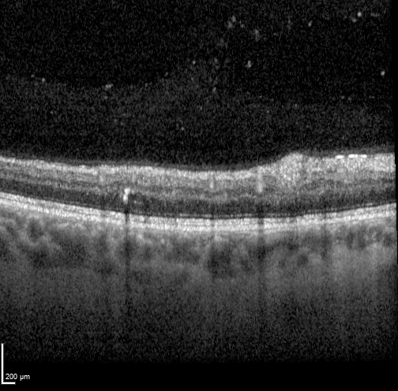
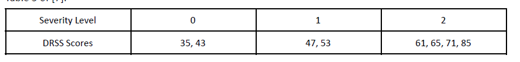

# ECE 8803 Final Project 
ECE 8803 Final Project 

Contributer: Michael Meng, Ziyu Liu

Georgia Instiute of Technology

Watch the presentation: https://youtu.be/xSJhzkPIE3Y

## Project Breif 
This Project is using 4 different approaches of Machine Learning algorithm to classify the Diabetic Retinopathy Severity Scale (DRSS) on OCT images from the [OLIVES dataset](https://arxiv.org/pdf/2209.11195.pdf). The full, pre-labeled OLIVE dataset includes both the PRIME and TREX_DME trails, and for the purpose of this project, data collected from PRIME trail was used. Within the PRIME data, there are 32,337 samples taken from 658 volumes. Example picture provided is a gray scale picture with (1x224x224) size which is disclosed below.

While the label include 8 classes of DRSS score -- 35, 43, 47, 53, 61, 65, 71, 85 -- we used a larger buffer to further categorize the images into 3 DRSS classes based on the score. 

By the end of the project, our goal is to train machine learning models that classify the provided image into DRSS Severity Level 0, 1, or 2

The language we used for this project is python, and 4 different methods we used are Naive Bayes, k-Nearest Neighbors(kNN), and two Convolutional Neural Network (CNN) architectures Alexnet and Resnet50. Among those two CNN architectures, Alexnet was trained from scrach, and Resnet50 was pre-trained and used for transfer learning. 

## Repository Navigation
If you want to re-produce our result, just download the OLIVE dataset and run the code in correct directory. 
None of the code need any arguments, just running the .py file should train, print, and save everything that you need! The .py files have two types -- ones for training and ones for testing. AE.py, Train_Resnet.py, Train_Alexnet.py are used for training models, and Test.py tests loads the trained model for prediction. AE is used for kNN and Naive Bayes prediction, and the idea is to reduce the computation resources required for classification. 

- AE.py: used for training and saving autoencoder that resizes frames in OLIVES to (512,512), then readjusts to (8,8) or (1,2) as needed.

- Train_Resnet.py: Training and Saving a ResNet50 model with transfer learning, meaning the weights are frozen

- Train_Alexnet.py: Training and saving a AlexNet model with newly initialized weights.

- AE_test.py: used for testing output of AE with kNN and Naive Bayes classifiers.

- Test.py: Testing the models generated by the above files, also can append snippets of code in kNN.py and bayes.py to run kNN or Naive Bayes.

- knn.py: append the code after running autoencoder should make the classification

## Result 
The highest accuracy we got was 44% using Alexnet, which indicates that convolutional training is more powerful in unnormal datasets. While OLIVES contains OCT images that are hard to identify, training a specific model for it become a more powerful yet computationally expensive method. 

## Future Work
We wish to train the model with more biomarks, so that the machine may predict more accuratly. 

